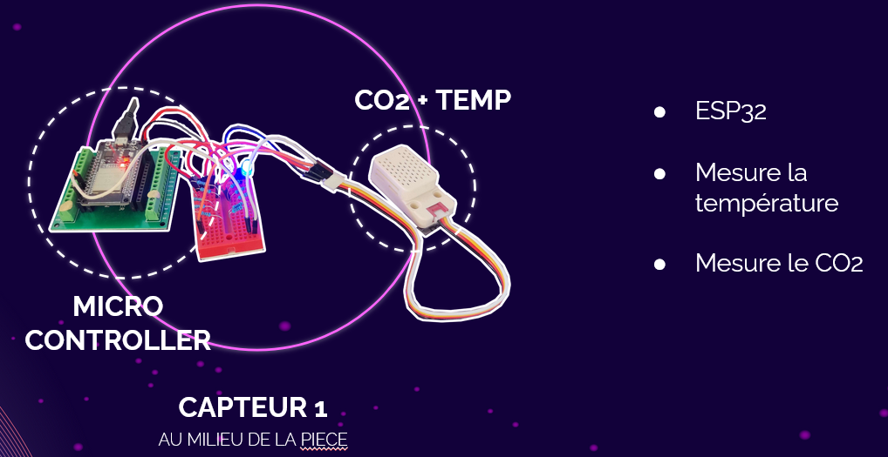
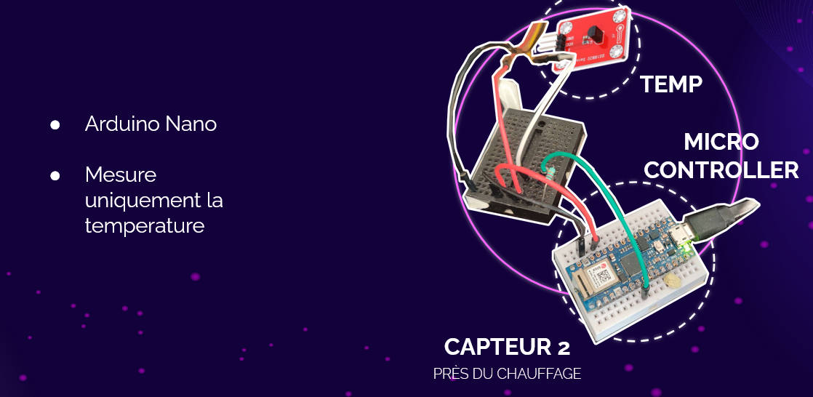
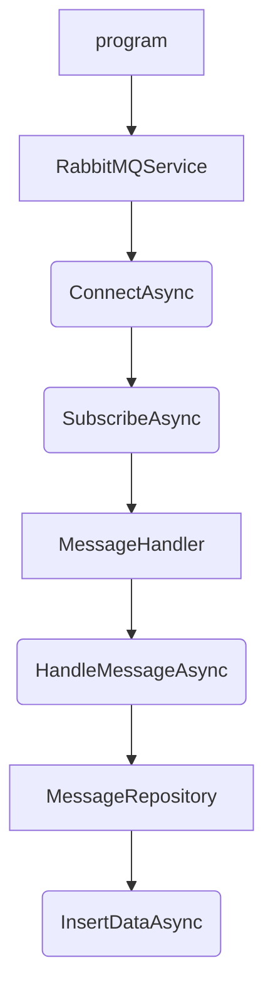
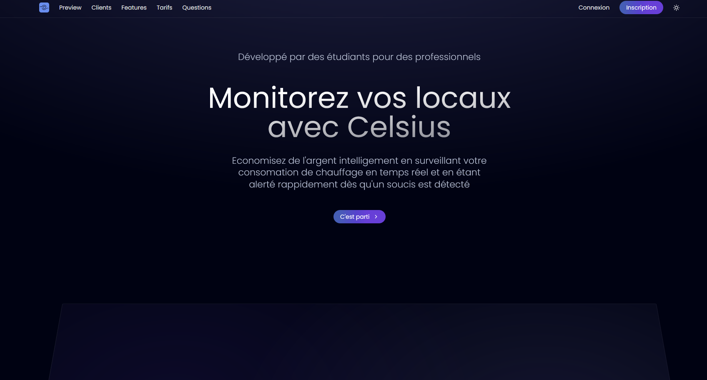
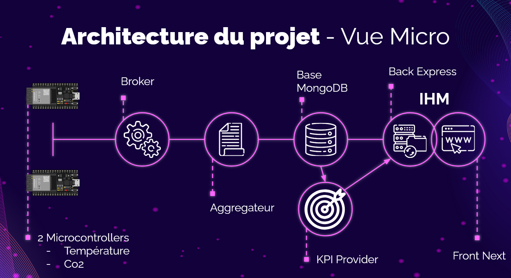
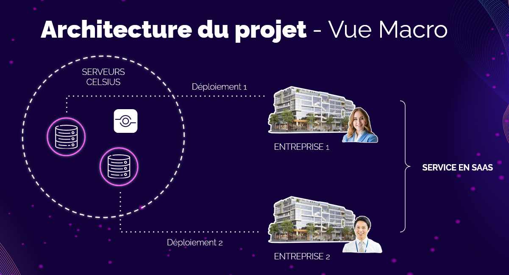

# DOCUMENTATION CELSIUS

## Présentation du projet : Celsius  

### Présentation  
Celsius est une solution innovante de monitoring énergétique, spécifiquement conçue pour les bureaux professionnels. Grâce à des capteurs connectés mesurant la température et la présence, et à une interface web accessible en mode SaaS, Celsius permet aux entreprises de mieux comprendre leur consommation énergétique et de l’optimiser. L’objectif est d’aider les organisations à adopter une gestion plus responsable de leur énergie tout en réduisant leurs coûts, le tout dans une approche simple et évolutive.  

### Problématique  
Comment responsabiliser les entreprises face à leur surconsommation électrique et les aider à réaliser des économies ?  
Aujourd’hui, les entreprises font face à des défis importants liés à leur consommation énergétique. Le chauffage et d’autres usages énergétiques dans les bureaux sont souvent mal maîtrisés, entraînant des dépenses inutiles et une empreinte environnementale excessive. Cette situation est aggravée par :  
- Un manque de données en temps réel pour suivre et comprendre la consommation énergétique.  
- L’absence d’outils pour ajuster les réglages en fonction de l’occupation réelle des espaces.  
- Une prise de conscience encore limitée sur les impacts économiques et environnementaux de cette surconsommation.  

Celsius propose une réponse directe à cette problématique en combinant technologie et simplicité pour encourager un comportement plus responsable.  

### Public cible  
Celsius s’adresse principalement aux :  
- Entreprises et bureaux professionnels : cherchant à réduire leurs factures énergétiques tout en améliorant leur impact environnemental.  
- Gestionnaires de bâtiments : souhaitant centraliser la gestion énergétique de leurs infrastructures et optimiser les performances de leurs équipements.  
- Organisations engagées dans la durabilité : désirant aligner leurs pratiques avec des objectifs écologiques et réduire leur empreinte carbone.  

### Objectifs du projet  
Celsius vise à répondre à cette problématique en poursuivant plusieurs objectifs clés :  
1. Responsabilisation énergétique : Sensibiliser les entreprises à leur consommation grâce à une visualisation claire et des rapports personnalisés.  
2. Optimisation des coûts : Réduire la surconsommation électrique en ajustant les paramètres en fonction des besoins réels des bureaux.  
3. Accessibilité et simplicité : Proposer une solution SaaS intuitive, utilisable depuis n’importe où, sans installation complexe.  
4. Évolutivité : Permettre l’ajout futur de nouvelles fonctionnalités comme l’intelligence artificielle ou de nouveaux capteurs pour élargir l’analyse énergétique.  
5. Impact environnemental : Aider les entreprises à réduire leur consommation d’énergie et, par extension, leur empreinte écologique, en les accompagnant vers des pratiques plus durables.  

Celsius se positionne comme un outil clé pour aider les entreprises à prendre conscience de leur impact énergétique, tout en leur offrant des solutions concrètes pour réaliser des économies et agir en faveur de l’environnement.

## Les capteurs




### Capteurs IoT  
Nous utilisons des capteurs connectés basés sur l'ESP32 :  
- Capteur de température simple : Collecte les données sur la température ambiante dans les bureaux.  
- Capteur combiné (température + CO2) : Mesure à la fois la température et le niveau de dioxyde de carbone pour fournir des données supplémentaires sur la qualité de l’air.  

Ces capteurs communiquent les données collectées via des protocoles de communication légers et efficaces.

---

### Passerelles de données  (broker)

Les données captées sont transmises via deux principales passerelles :  
1. MQTT : Protocole de messagerie léger, utilisé pour acheminer les données des capteurs vers le système en temps réel.  
2. Internet (WAN/LAN) : Les communications se font à travers des réseaux locaux ou étendus, selon la configuration.  
3. RabbitMQ : Plateforme de gestion des files d’attente de messages utilisée pour assurer une communication fiable et ordonnée entre les différentes composantes du backend.  

# RabbitMQ Docker

Run a Rabbit Message Que using Docker and Docker-Compose. Install all [necessary plugins](https://www.rabbitmq.com/protocols.html) to use RabbitMQ as your MQTT Broker and connect to with your client software either using the MQTT or AMQP protocol over a websocket connection.


## Run

Run the container with the following command to be able to see the container log for debugging. The container will expose 

```bash
docker-compose up

Starting rabbitmq ... done
Attaching to rabbitmq
rabbitmq    | Enabling plugins on node rabbit@1a7c322456fc:
rabbitmq    | rabbitmq_mqtt
rabbitmq    | rabbitmq_web_mqtt
rabbitmq    | rabbitmq_amqp1_0
rabbitmq    | The following plugins have been configured:
rabbitmq    |   rabbitmq_amqp1_0
rabbitmq    |   rabbitmq_management
rabbitmq    |   rabbitmq_management_agent
rabbitmq    |   rabbitmq_mqtt
rabbitmq    |   rabbitmq_prometheus
rabbitmq    |   rabbitmq_web_dispatch
rabbitmq    |   rabbitmq_web_mqtt
rabbitmq    |   ##  ##      RabbitMQ 3.9.14
rabbitmq    |   ##  ##
rabbitmq    |   ##########  Copyright (c) 2007-2022 VMware, Inc. or its affiliates.
rabbitmq    |   ######  ##
rabbitmq    |   ##########  Licensed under the MPL 2.0. Website: https://rabbitmq.com
rabbitmq    | 
rabbitmq    |   Erlang:      24.3.3 [jit]
rabbitmq    |   TLS Library: OpenSSL - OpenSSL 1.1.1n  15 Mar 2022
rabbitmq    | 
rabbitmq    |   Doc guides:  https://rabbitmq.com/documentation.html
rabbitmq    |   Support:     https://rabbitmq.com/contact.html
rabbitmq    |   Tutorials:   https://rabbitmq.com/getstarted.html
rabbitmq    |   Monitoring:  https://rabbitmq.com/monitoring.html
rabbitmq    | 
rabbitmq    |   Logs: /var/log/rabbitmq/rabbit@1a7c322456fc_upgrade.log
rabbitmq    |         <stdout>
rabbitmq    | 
rabbitmq    |   Config file(s): /etc/rabbitmq/advanced.config
rabbitmq    |                   /etc/rabbitmq/rabbitmq.conf
rabbitmq    |                   /etc/rabbitmq/conf.d/10-defaults.conf
```


```bash
docker exec -ti rabbitmq rabbitmq-diagnostics status

Plugins

Enabled plugin file: /etc/rabbitmq/enabled_plugins
Enabled plugins:

 * rabbitmq_prometheus
 * prometheus
 * rabbitmq_amqp1_0
 * accept
 * rabbitmq_web_mqtt
 * rabbitmq_mqtt
 * rabbitmq_management
 * amqp_client
 * rabbitmq_web_dispatch
 * cowboy
 * cowlib
 * rabbitmq_management_agent

Config files

 * /etc/rabbitmq/advanced.config
 * /etc/rabbitmq/rabbitmq.conf
 * /etc/rabbitmq/conf.d/10-defaults.conf

Listeners

Interface: [::], port: 15672, protocol: http, purpose: HTTP API
Interface: [::], port: 1883, protocol: mqtt, purpose: MQTT
Interface: [::], port: 15675, protocol: http/web-mqtt, purpose: MQTT over WebSockets
Interface: [::], port: 15692, protocol: http/prometheus, purpose: Prometheus exporter API over HTTP
Interface: [::], port: 25672, protocol: clustering, purpose: inter-node and CLI tool communication
Interface: [::], port: 5672, protocol: amqp, purpose: AMQP 0-9-1 and AMQP 1.0
```


## Connections

Check the `./docker-compose.yml` file for the published ports:


| Service | Exposed Port |
| -- | -- |
| __AMQP__ | `5672` |
| __Management__ | `8080` |
| __MQTT__ | `1883` |
| __WebSocket__ | `1885` |


You can access the webinterface on port `8080` and connect to the MQTT Broker on port 1883 - both use default login specified in `./config/login.env`:


MQTT over WebSocket can be accessed at `ws://server-address:1885/ws`.


Once everything is working use the `-d` flag to detached the container from your console:

```bash
docker-compose up -d
```

---

# CELSIUS 📡

## AGREGATOR

Ici le service permettant de récupérer et stocker toutes les données renvoyées par nos centaines de capteurs dans une base NoSQL

# Documentation de l'API .NET 6

Cette documentation vise à expliquer la structure, le fonctionnement et les différentes parties de l'API développée en .NET 6. L'architecture de l'API est organisée en plusieurs dossiers et fichiers pour une gestion modulaire.

## Structure de l'API

### Dossier `Configuration`

#### Fichiers :
- **`CelsiusDatabaseSettings.cs`**

Ce fichier permet de stocker les paramètres de configuration pour la base de données Celsius qui ce trouve dans **appsettings.json**.

- **`RabbitMQSettings.cs`**

Ce fichier permet de stocker les paramètres de configuration de RabbitMQ qui ce trouve dans **appsettings.json**.


### Dossier `Controllers`

#### Fichiers :
- **`DataController.cs`**

Contrôleur principal de l'API qui gère les requêtes relatives aux données.

### Dossier `Handler`

#### Fichiers :
- **`MessageHandler.cs`**

Implémente la logique de traitement des messages reçus.
Traite les données reçues, effectue des opérations de transformation et appel par la suite le repository pour insérer le résultat.

### Dossier `Models`

#### Fichiers :
- **`SensorData.cs`**

Définit la structure de données pour les capteurs.
Enregistre les données des capteurs, telles que le CO2, la température, la date, la présence, et le chauffage.

### Dossier `Repository`

#### Fichiers :
- **`MessageRepository.cs`**

Gère les opérations de récupération et d'insertion de données.

### Dossier `Services`

#### Fichiers :
- **`RabbitMQService.cs`**

Établit la connexion avec RabbitMQ et gère la réception des messages.


## Schéma de fonctionnement du flux RabbitMQ


---

### Backend  

Swagger : /api/v1/docs

Le backend est construit avec Express.js, un framework Node.js.  
- Rôle : Réceptionne les données brutes des capteurs, les traite si nécessaire, et les stocke dans la base de données.  
- Il gère également les API RESTful qui permettent à l’interface web et aux autres composants d’accéder aux données ou de configurer les systèmes.

---

### Base de données  

Les données collectées sont stockées dans une base MongoDB.  
- Rôle : Centraliser et structurer les données provenant des capteurs.  
- Les données y sont organisées pour permettre des requêtes rapides et l’analyse des tendances à long terme.  

---

### KPI Provider (Python)  

```
Virtual environment:  
py -3 -m venv .venv  
.venv\Scripts\activate  
deactivate  

Running the app:  
python -m uvicorn main:app --port 8000  
python -m uvicorn main:app --port 8000 --reload #HotReload  
  
swagger : http://localhost:PORT/docs  
```

Un module en Python se charge de calculer les KPI (Key Performance Indicators) à partir des données collectées.  
- Exemples de KPI :  
  - Moyenne des températures quotidiennes.  
  - Temps d’inoccupation des bureaux avec chauffage actif.  
  - Analyse des pics de CO2 dans l'air.  
- Ces calculs permettent de générer des rapports détaillés et d’alimenter les tableaux de bord en données analysées.

---

### Frontend  
L’interface utilisateur est développée en Next.js, un framework React.  
- Rôle : Affiche les données collectées et analysées sous forme de tableaux de bord interactifs.  
- Fonctionnalités principales :  
  - Visualisation des graphiques de température et de CO2 en temps réel.  
  - Génération de rapports téléchargeables.  
  - Paramétrage des alertes et des seuils critiques.  

---

### Flux de données  
Voici comment les données circulent entre les différents composants :  
1. Les capteurs ESP32 collectent des données en temps réel (température et/ou CO2).  
2. Ces données sont transmises via MQTT à un broker RabbitMQ.  
3. RabbitMQ relaie les données au backend Express.js, qui les structure et les envoie à MongoDB pour stockage.  
4. Le KPI provider Python extrait les données de MongoDB, les traite, et calcule les indicateurs clés.  
5. Les résultats des calculs sont renvoyés au backend, qui les expose via des API RESTful.  
6. Le frontend Next.js interroge les API pour afficher les données et les visualisations en temps réel à l'utilisateur.  





## Fonctionnalités Clés  

### Monitoring en temps réel  
Celsius offre une surveillance continue des données collectées par les capteurs installés dans les bureaux.  
- Les capteurs de température et de CO2 envoient leurs mesures en temps réel, permettant un suivi instantané de l’état des environnements.  
- Ces données sont visualisées sur des tableaux de bord interactifs accessibles via une interface web.  
- Les utilisateurs peuvent consulter des graphiques dynamiques qui reflètent les variations de température et de qualité de l’air au fil du temps.  
- Cette fonctionnalité permet une prise de décision rapide pour optimiser le confort et l’efficacité énergétique.  

---

### Génération de rapports  
La solution génère automatiquement des rapports basés sur les données collectées et les analyses effectuées.  
- Rapports périodiques : Quotidiens, hebdomadaires ou mensuels, avec des statistiques clés comme les températures moyennes, les pics de CO2, et les périodes de surconsommation énergétique.  
- Personnalisation : Les utilisateurs peuvent sélectionner les paramètres qu’ils souhaitent inclure dans les rapports.  
- Formats variés : Les rapports sont téléchargeables sous forme de fichiers PDF ou CSV, facilitant le partage et l’intégration dans les processus internes des entreprises.  

---

### Alertes et notifications  
Pour garantir une gestion proactive, Celsius inclut un système d’alertes configurable par les utilisateurs.  
- Alertes en temps réel : Notifie les utilisateurs lorsqu’une anomalie est détectée, comme une température trop basse ou un niveau de CO2 élevé.  
- Modes de notification : Par e-mail, SMS ou directement via l’interface web.  
- Personnalisation des seuils : Les seuils critiques pour chaque paramètre peuvent être définis manuellement, en fonction des besoins spécifiques des bureaux.  
- Historique des alertes : Les utilisateurs peuvent consulter l’historique des notifications pour mieux comprendre les tendances et identifier les problèmes récurrents.  

## Sécurité  

La sécurité est un aspect central de notre projet Celsius, garantissant que les données sensibles des entreprises sont protégées tout au long du processus, de la collecte des données à leur consultation via l’interface web. Voici les principales mesures mises en place :  

### Protection contre les injections SQL  
Nous utilisons un ORM (Object-Relational Mapping) pour interagir avec la base de données. Cette approche élimine les risques d’injection SQL en générant automatiquement des requêtes sécurisées, évitant ainsi toute manipulation malveillante des données.  

### Validation et nettoyage des entrées utilisateur  
Nous avons intégré des bibliothèques comme Validator.js pour valider et nettoyer les données entrantes. Cela permet de :  
- Vérifier que les informations fournies (par exemple, des e-mails ou des mots de passe) respectent les formats attendus.  
- Empêcher l’insertion de contenu malveillant, comme des scripts ou des caractères spéciaux destinés à exploiter des vulnérabilités.  

### Sécurisation des en-têtes HTTP avec Helmet  
Nous utilisons le middleware Helmet pour configurer et renforcer les en-têtes HTTP. Cela protège contre plusieurs attaques courantes, telles que :  
- Clickjacking  
- Attaques XSS (Cross-Site Scripting)  
- Réduction de l’exposition des technologies utilisées via l’en-tête `X-Powered-By`  

### Contrôle des accès avec CORS  
Le module CORS (Cross-Origin Resource Sharing) est configuré pour limiter les accès à l’API.  
- Seules les origines autorisées (comme le domaine de l’application web) peuvent envoyer des requêtes à l’API.  
- Cela empêche des acteurs externes non autorisés d’interagir avec notre backend.  

### Authentification sécurisée avec JWT  
Pour sécuriser les sessions utilisateur, nous utilisons des JSON Web Tokens (JWT) :  
- Les tokens sont générés lors de l’authentification et contiennent des informations cryptées permettant de vérifier l’identité de l’utilisateur.  
- Les tokens expirent après un délai défini, limitant ainsi les risques en cas de compromission.  
- Chaque requête effectuée par l’utilisateur nécessite un token valide, assurant un accès strictement contrôlé aux ressources et données.  

## Tests

Tests unitaires et d'intégration

Tests de charges

Resultats

## Déploiement

Environnement de déploiement

Configuration requise

Automatisation du déploiement et outils utilisés pour de deploy

## Conclusion et Perspectives

### Résumé des réalisations  
Depuis le lancement de notre projet, nous avons réussi à développer une solution fonctionnelle pour le monitoring des systèmes de chauffage dans les bureaux. Les capteurs de température et de présence collectent efficacement les données, qui sont ensuite centralisées dans une base de données sécurisée. Ces informations sont accessibles via une interface web intuitive, où les utilisateurs peuvent visualiser des tableaux de bord, consulter des rapports automatiques, et recevoir des alertes en cas de besoin. La solution, déployée en mode SaaS, permet une accessibilité à distance, simplifie les mises à jour, et garantit la sécurité des données. Ces réalisations posent une base solide pour la gestion énergétique des bâtiments professionnels.  

### Limitations actuelles  
Malgré ces avancées, certaines fonctionnalités essentielles restent à développer. Actuellement, notre solution ne permet pas encore de modifier directement les réglages des radiateurs ou systèmes de chauffage à partir de l’application. Cette interaction devra être intégrée pour une automatisation complète. Par ailleurs, bien que nous ayons commencé à explorer l’analyse prédictive, aucun modèle d’intelligence artificielle (IA) n’a encore été déployé en production. Cela limite notre capacité à anticiper les besoins énergétiques ou à optimiser automatiquement les réglages.  

### Améliorations futures  
Pour répondre à ces limitations, nous prévoyons plusieurs améliorations :  
- Contrôle direct du chauffage : Nous intégrerons des dispositifs permettant de modifier les températures directement via l’application, créant ainsi une solution entièrement connectée et interactive.  
- Mise en place de l’IA : Nous allons développer et déployer des modèles d’intelligence artificielle capables d’analyser les données collectées pour anticiper les besoins en chauffage, optimiser la consommation énergétique, et proposer des recommandations automatiques.  
- Extension des fonctionnalités : Enrichir les tableaux de bord avec des visualisations avancées, intégrer de nouveaux capteurs (qualité de l’air, humidité), et permettre une personnalisation encore plus fine des alertes et des rapports.  
- Amélioration de la scalabilité : Adapter la solution pour la gestion de plusieurs sites, tout en assurant une interface fluide et un support robuste.  

Ces améliorations futures renforceront l’efficacité de notre solution et répondront aux attentes des utilisateurs pour une gestion énergétique complète et intelligente.

### Schema d'architecture globale



### Schema de deploiement dans les entreprise

Pour notre projet, nous avons choisi de déployer la solution en mode SaaS (Software as a Service). Cela signifie que les clients n’auront pas besoin d’installer de logiciel localement, tout sera hébergé sur nos serveurs, et accessible directement via une interface web.

Les données collectées par les capteurs (température, présence, etc.) seront centralisées dans notre base de données sécurisée. Cette base servira de point de stockage unique pour l’ensemble des données de nos clients. À partir de ces données, nous pourrons générer des visualisations en temps réel, des tableaux de bord interactifs et des rapports personnalisés.

Chaque client disposera d’un compte dédié avec des identifiants uniques pour accéder à une interface web personnalisée. Depuis cette interface, ils pourront consulter les données de leurs capteurs, surveiller l’état de leurs équipements, et recevoir des alertes en cas d’anomalies ou de dépassements de seuil. De plus, les clients auront accès à des fonctionnalités avancées comme la gestion des utilisateurs, la configuration des alertes, et la possibilité de télécharger des rapports sous différents formats (PDF, CSV).



## Crédits

Aleksandar  jovici_a@etna-alternance.net
Raphael     alaux_r@etna-alternance.net
Yannis      tudeau_y@etna-alternance.net
Paul        lequeu_p@etna-alternance.net
Maxence     vacher_m@etna-alternance.net
Julien      tosti_m@etna-alternance.net
Adrien      pavelo_a@etna-alternance.net
Timothée    doudon_t@etna-alternance.net

Ce projet est notre projet de fin d'année, aussi appelé "Grand Projet Etna" ou "GPE" durant nos deux années de master.

© 2024 Aleksandar, Raphael, Yannis, Paul, Maxence, Julien, Adrien, Timothée. Tous droits réservés. Vous êtes autorisé à utiliser, modifier et personnaliser ce projet à votre guise, sous réserve de mentionner les auteurs originaux. 
